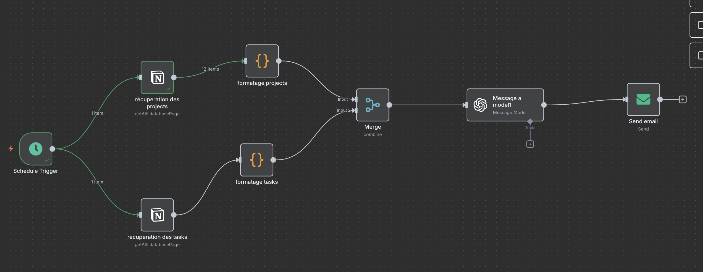

## Première impression

J'ai beaucoup entendu parler de l'outil **n8n**, outil d'automatisation et de workflow management. J'avais un peu de mal à concevoir l'intérêt d'un tel outil mais je me suis dit "Ok, je vais tester".

## Installation

Hop, direction OVH, je prends un petit VPS, je prends l'option de backup automatique car je suis un peu frileux et je me connais. J'aime flirter avec le danger.

Je crée ma petite entrée DNS et j'installe.

### Documentation suivie

La documentation que j'ai suivie : [Installation Docker Compose](https://docs.n8n.io/hosting/installation/server-setups/docker-compose/)

### Expérience avec Docker

J'ai l'habitude de faire tourner les applications que j'utilise dans des containers. De manière plus générale, j'ai l'habitude de Docker Compose. Honnêtement, je vais devoir essayer autre chose. Kubernetes ou Swarm quand j'aurai le temps, histoire de me familiariser avec autre chose !

Bref, l'installation de n8n on-premise est étonnamment simple. Tout est intégré au Docker Compose y compris la génération de certificat, ce qui fait qu'on se retrouve très rapidement avec un site fonctionnel.

Évidemment, c'est simple à partir du moment où on lit un minimum la doc. **RTFM** comme disait l'autre !

## Première étape : mon premier workflow

En fait, lorsque je suis arrivé devant l'interface épurée de n8n, je me suis dit : *"Ça y est, c'est installé... et maintenant ?"*

En vrai, qu'est-ce que je peux faire comme workflow ? De quoi est capable cet outil ? Est-ce qu'au fond c'est vraiment mieux qu'un petit script Python qui fait des calls API ?

## Contexte personnel : Notion et PARA

J'aime bien **Notion**. J'essaie autant que je peux de l'utiliser pour organiser ma vie perso. Je trouve l'outil assez puissant et épuré. Dernièrement j'ai essayé le template "Second Brain" de Modern Byte.

Ça m'a permis de m'introduire à la méthode de Tiago Forte : **PARA** (pour Project, Area, Resources, Archive).

## Mon premier workflow

Voici le workflow que j'ai mis en place, mon premier workflow (ne vous moquez pas, j'en suis plutôt fier) :

Il s'agit d'un workflow qui fait la chose suivante : tous les matins à 7h30, il m'envoie un récap des projets non terminés et des tâches de la journée.

### Comment ça fonctionne ?

L'interface de n8n est plutôt intuitive. Le fonctionnement est simple : on met en place un node trigger (déclencheur) qui, une fois activé, exécute tous les nodes auxquels il est lié en transmettant les données des nodes précédents (souvent au format JSON).

### Les étapes du workflow

Sans entrer dans les détails techniques, voici ce que fait mon workflow :

1. **Trigger Schedule** : Se déclenche tous les matins à 7h30
2. **Notion Database** : Récupère les projets non terminés
3. **Notion Database** : Récupère les tâches du jour
4. **OpenAI** : Envoie les données à GPT-3.5 pour générer un message personnalisé
5. **Email** : M'envoie le récapitulatif par mail

## Conclusion

Le workflow n'est pas compliqué et fait exactement ce qu'on lui demande. C'est très satisfaisant de voir chaque matin la pipeline s'activer automatiquement pour m'envoyer un rappel par mail.

Même si je ne sais pas encore si j'ai vraiment besoin de ce rappel quotidien, cette expérience m'a permis de comprendre l'intérêt de n8n et comment l'utiliser. Maintenant que j'ai le produit, il ne me reste plus qu'à trouver le besoin qu'il comblera (quitte à le créer **gasp**).

## Prochaines étapes

J'ai quelques idées d'automatisation en tête :
- Synchronisation automatique entre mes différents outils
- Rappels intelligents basés sur mes habitudes
- Génération automatique de rapports hebdomadaires

L'avantage de n8n, c'est qu'on peut commencer simple et complexifier progressivement selon ses besoins.
